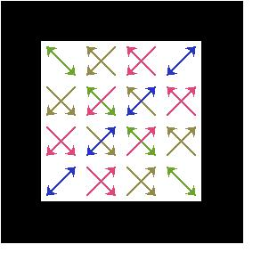
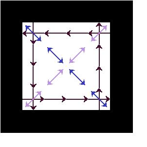
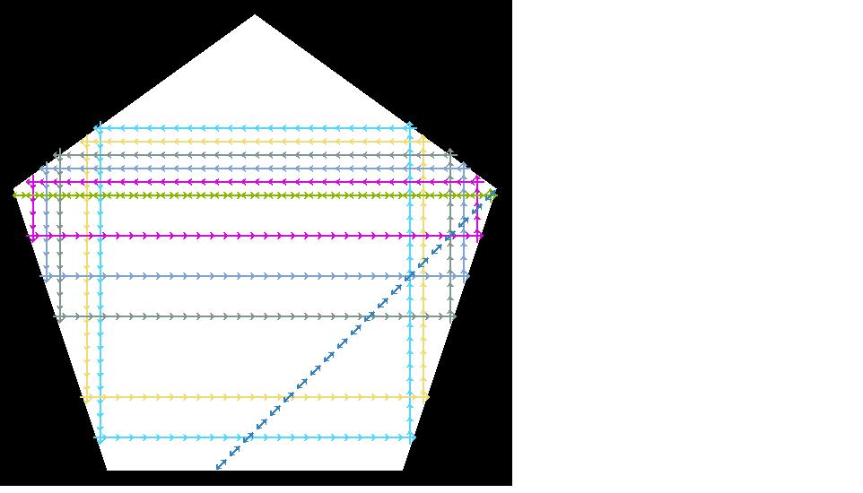
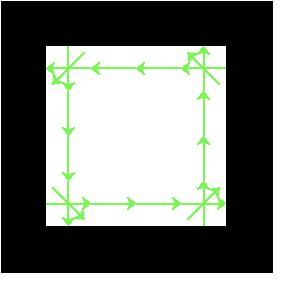
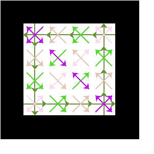
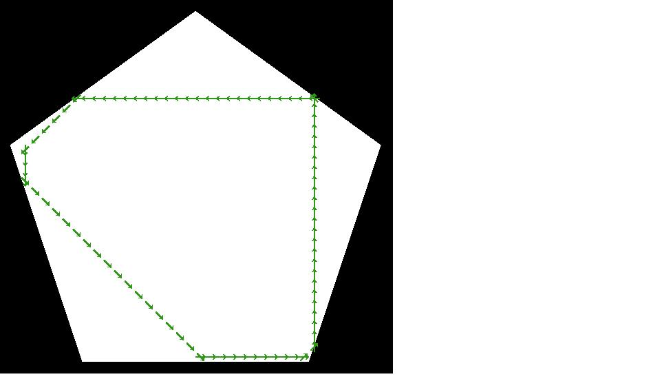

Bouncing with respect to the normal of an edge of a simple polygonal environment
--------------------------------------------------------------------------------

We consider the state space as $R^2 \times S^1$ where there is 8
different orientations of $S^1$ with $45^\circ$ separation
between each orientation.

### bouncing angle 45 in the square

Every point on the boundary has a neutrally stable orbit associated w/ it.
Discrete simulation finds all orbits up to discretization. We expect finer
discretization to produce more orbits.

Sample command to produce figures, in case anyone wants to experiment with it:

`stack exec -- bounce-exe -e square -a 0.785 -s 0.1 -o output.svg`

Every possible start position (-s param) produces a unique orbit. Two samples
shown.

{width=4cm}\ 
{width=4cm}\ 
{width=4cm}\ 

### bouncing angle 90 in the square

The diagonal orbits found by the discrete approach appear to be infeasible. How
does the method handle corner bouncing?

{width=4cm}\ {width=4cm}\

### bouncing angle 45 in the pentagon

From our Theorem 3, we would expect a bounce at 45 degrees to produce one
unique, globally stable orbit that skips 1 edge with every bounce. We see this
in simulation:

{width=8cm}\ {width=5cm}

Rectangular orbits in the pentagon are infeasible. We think the angular
discretization is the issue - the robot is "snapping" to one of the angles (0,
45, 90, etc) instead of performing the correct bounce. See below for a figure
demonstrating that geometrically, the robot is not performing a correct bounce:

{width=15cm}

The one non-rectangular orbit also seems like a discretization error - at the
very least, we would expect it to be repeated on each side by symmetry.

**Idea:** you can generate the global angular discretization *from the description of
the environment.* For example, in the regular pentagon, take one side of the
pentagon to be oriented at 0 radians. You need to be able to
bounce at 45 degrees (switching to radians at this point, so $\pi/4$) from this
side. The next side is rotated at $3\pi/5$ from the first, so you also need to
be able to bounce at $3\pi/5+\pi/4$ radians. Etc for each side.

With an environment as input, you can generate all the wall normals in a global
frame, rotate each of them by the desired amount for your set of bouncing
angles, and the resulting set will be the angular discretization you need.

Bouncing with respect to the previous direction of robot’s motion
-----------------------------------------------------------------

### bounce at 45 in square

{width=6cm}\ {width=5cm}

Orbits are sensitive to initial orientation. Thus angular discretization
determines how many orbits will be found.

### bounce at 90 in square

{width=6cm}\ {width=5cm}

General agreement. Again, we would expect more orbits with finer discretization.

{width=7cm}\ {width=5cm}

Very interesting!!! These orbits are qualitatively similar - my program is not
very good at "wall following" (will treat this as a collision), which I think
explains the different trajectory in the bottom right.

Interesting note from experiments - pi-rational angles appear to produce stable
orbits in the regular pentagon with this bouncing law. See below for some
examples. Conjecture... might be proven already somewhere in the literature.

{width=5cm}

{width=5cm}

{width=5cm}
